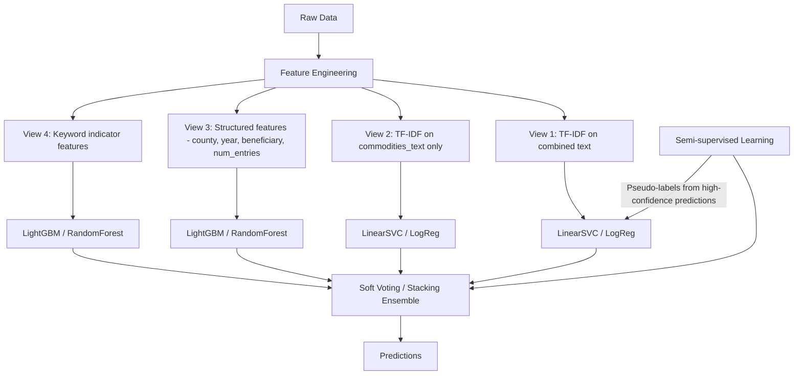

# Strategic Plan: Historical Supplier Occupation Classification

## Problem Summary

Classify **591 test suppliers** into **10 occupation roles** based on historical billing/transaction records from 18th-19th century English parishes (poor law records). Training set has **485 labelled suppliers**. The metric is **macro-F1** (must perform well across ALL classes, including rare ones).

---

## EDA Findings

### Dataset Structure

| Dataset | Shape | Notes |
|---|---|---|
| `entries.csv` | 33,720 rows × 7 cols | Transaction-level records |
| `train.csv` | 485 rows × 2 cols | supplier_id → occupation_role |
| `test_suppliers.csv` | 591 rows × 1 col | supplier_ids to predict |
| All suppliers in entries | 3,377 unique | 2,301 unlabelled suppliers available |

### Class Distribution (Heavily Imbalanced!)

| Class | Count | Proportion |
|---|---|---|
| **Local administration** | 147 | **30.3%** ← Dominant |
| Medicine | 74 | 15.3% |
| Food | 44 | 9.1% |
| Operative | 30 | 6.2% |
| Dress | 30 | 6.2% |
| Law | 30 | 6.2% |
| Clothing materials | 30 | 6.2% |
| Wines spirits & hotels | 30 | 6.2% |
| General dealers | 30 | 6.2% |
| Unspecified dealers | 30 | 6.2% |

> [!IMPORTANT]
> **Heavy class imbalance**: "Local administration" is 5× overrepresented vs. the 8 minority classes. Since the metric is **macro-F1**, minority classes matter equally. The current solution uses `class_weight='balanced'` which is necessary but may not be sufficient.

### Key Data Characteristics

| Feature | Finding |
|---|---|
| **Entries per supplier** | Median=2, Mean=10, Max=1,546. Very skewed — some suppliers have massive records |
| **Text length** | Transcriptions: avg 43 chars, 9 words. Short, telegraphic text |
| **Counties** | 3 counties (East Sussex, Cumbria, Staffordshire), balanced. Each supplier belongs to exactly 1 county |
| **Year range** | 1705–1840, mean ≈1803. 4% missing |
| **Beneficiary status** | Highly informative! "pauper" dominates General dealers (0.33 ratio), Food (0.21). "child" signals Dress (0.09) |
| **All test suppliers have entries** | No cold-start problem |

### Discriminative Keywords per Class (Critical Insight!)

Each class has **extremely distinctive vocabulary**:

| Class | Signature Keywords |
|---|---|
| **Clothing materials** | yds, lin, thread, blue, cloth, duffel, calico, flannel, plading, buttons |
| **Dress** | clogs, clog, calk, coakered, clogd, ironed, calkers (shoe/clog making) |
| **Food** | beef, flour, mutton, candles, meat, sheeps, salt, meal, tea, sugar, rye, barley |
| **General dealers** | thread, yds, ells, tape, hose, buttons, oil, dowlass, worsted, yarn, hat, frock |
| **Law** | sessions, attending, appeal, order, fee, brief, drawing, clerk, subpoena, advising |
| **Local administration** | weeks, relief, overseer, cash, workhouse, township, recd |
| **Medicine** | mixture, pills, pulv, powders, journey, ointment, julep, anod, purg, visit |
| **Operative** | day, days, mending, work, church, labour, glazing, stones, glass, building |
| **Unspecified dealers** | beer, goods, coffin, brushes (mixed goods) |
| **Wines spirits & hotels** | beer, ale, liquor, barm, wine, breakfast, dinner, tobacco, brandy, gin |

> [!TIP]
> The keyword signatures are **very strong and distinct**. This is fundamentally a text classification problem where bag-of-words features should work well. The challenge is distinguishing overlapping classes (e.g., "Clothing materials" vs "General dealers" — both have thread/yds/buttons; "Food" vs "Wines spirits & hotels" — both have meat/ale).

### Analysis of Current Solution (solution.py)

The existing approach uses:
- **TF-IDF** (1-3 ngrams, 60k features, sublinear_tf) on concatenated transcription + commodities_text
- **Logistic Regression** (liblinear, C=2.0, balanced class weights)
- Fits vectorizer on all suppliers (semi-supervised vocabulary)

**Weaknesses identified**:
1. **Only uses text features** — ignores county, year, beneficiary_status, num_entries
2. **Single model** — no ensemble or stacking
3. **No cross-validation** for hyperparameter tuning
4. **No text preprocessing** — historical OCR text has inconsistent spelling
5. **Ignores commodities_text independently** — this field is cleaner and more standardized
6. **No semi-supervised learning** — 2,301 unlabelled suppliers are wasted (only used for vocab)
7. **liblinear solver** — doesn't support multinomial loss, uses OvR which may be suboptimal

---

## Strategic Plan

### Strategy Overview: Ensemble of Diverse Feature Views

The core insight is that different **feature views** capture different aspects of the problem. We should build specialized models and ensemble them.

### Phase 1: Enhanced Feature Engineering

#### 1A. Text Features (Primary Signal)

| Feature Set | Description | Rationale |
|---|---|---|
| **TF-IDF combined** | TF-IDF on `transcription + commodities_text` aggregated per supplier. Use (1,3) ngrams, 80k features, sublinear_tf | Baseline approach, broad coverage |
| **TF-IDF commodities only** | TF-IDF on `commodities_text` only. Use (1,2) ngrams, 30k features | Commodities text is **cleaner and more standardized** — less OCR noise |
| **Character n-grams** | TF-IDF char ngrams (2,5) on combined text | Captures partial word matches, handles OCR misspellings (e.g., "paupeer" → "pauper") |
| **Keyword indicators** | Binary features for class-discriminative keywords (top 15 per class) | Explicit signal for the most informative words |

#### 1B. Structured Features (Secondary Signal)

| Feature | Description | Discriminative? |
|---|---|---|
| **county** (one-hot) | 3 counties, each supplier tied to exactly 1 | Moderate — some classes skew by county |
| **avg_year, min_year, max_year** | Temporal range of activity | Moderate — General dealers peak earlier (~1789) |
| **num_entries** | Transaction volume | Yes — General dealers have 130 avg vs 5 for Unspecified |
| **pauper_ratio** | Fraction of entries with beneficiary="pauper" | Strong — General dealers 0.33, Clothing 0.01 |
| **child_ratio** | Fraction of entries with beneficiary="child" | Moderate — Dress 0.09 vs others ~0 |
| **beneficiary_diversity** | Number of unique beneficiary statuses | Informative |
| **avg_text_length** | Mean transcription length | Proxy for transaction complexity |
| **commodity_diversity** | Number of unique commodities_text values | High for general dealers |

### Phase 2: Model Selection (CPU-Friendly)

> [!NOTE]
> All methods below are CPU-native and train in seconds to minutes on this dataset size.

#### Candidate Models

| Model | Feature View | Rationale |
|---|---|---|
| **LinearSVC** (sklearn) | TF-IDF combined | Best-in-class for high-dimensional sparse text. Often outperforms LogReg |
| **LogisticRegression** (saga solver) | TF-IDF commodities | Probability calibration for ensembling |
| **SGDClassifier** (log loss) | Char n-grams TF-IDF | Fast, scalable, regularization control |
| **LightGBM** | Structured + keyword features | Handles mixed feature types natively, fast on CPU |
| **RandomForest** | Structured + keyword features | Robust baseline for tabular data |
| **MultinomialNB** | TF-IDF combined | Often surprisingly competitive for text, provides diversity in ensemble |

#### Why NOT deep learning / transformers?
- Dataset is tiny (485 train samples) — transformers would overfit catastrophically
- Text is short (avg 9 words per entry) — no long-range dependencies to capture
- Historical English vocabulary is domain-specific — pretrained embeddings have poor coverage
- TF-IDF + linear models are SOTA for small text classification with strong keyword signals

### Phase 3: Semi-Supervised Learning (Leverage 2,301 Unlabelled Suppliers)

This is the **biggest untapped opportunity**. The existing solution only uses unlabelled data for vocabulary fitting.

#### Approach: Iterative Pseudo-Labeling

1. Train initial model on 485 labelled suppliers
2. Predict on 2,301 unlabelled suppliers
3. Select high-confidence predictions (probability > 0.85)
4. Add pseudo-labelled data to training set
5. Retrain and repeat (2-3 iterations)
6. Use confidence thresholds per-class to handle imbalance

#### Alternative: Label Spreading / Label Propagation
- Sklearn's `LabelSpreading` with RBF kernel on TF-IDF features
- Can propagate labels through the supplier graph
- CPU-friendly, works well with small labelled sets

### Phase 4: Ensemble Strategy

#### Soft Voting Ensemble
- Collect predicted probabilities from each model
- Weighted average (weights tuned via CV)
- Predict argmax of averaged probabilities

#### Stacking (if time allows)
- Use out-of-fold predictions from base models as features
- Train a meta-learner (LogReg or LightGBM) on stacked features
- More powerful but requires careful CV

### Phase 5: Cross-Validation & Hyperparameter Tuning

- **StratifiedKFold (k=5)** to preserve class ratios
- Grid search over key hyperparameters:
  - TF-IDF: max_features, ngram_range, min_df, max_df
  - LinearSVC: C (regularization)
  - LightGBM: num_leaves, learning_rate, n_estimators
- **Optimize for macro-F1** (not accuracy!)

### Phase 6: Post-Processing

- **Confidence calibration**: Use `CalibratedClassifierCV` for LinearSVC
- **Per-class threshold tuning**: Adjust decision boundaries per class on CV predictions to maximize macro-F1
- **Confusion analysis**: Identify and address systematic misclassifications (e.g., "Clothing materials" ↔ "General dealers")

---

## Execution Priority (Ranked by Expected Impact)

| Priority | Action | Expected Impact | Effort |
|---|---|---|---|
| 🔴 **1** | Add structured features (county, beneficiary ratios, num_entries) + LightGBM | **High** — captures signals text misses | Low |
| 🔴 **2** | Switch to LinearSVC for text features | **Medium-High** — typically beats LogReg on sparse text | Low |
| 🟡 **3** | Add commodities-only TF-IDF as separate view | **Medium** — cleaner signal | Low |
| 🟡 **4** | Ensemble multiple models (soft voting) | **Medium-High** — diversity reduces variance | Medium |
| 🟡 **5** | Semi-supervised pseudo-labeling | **Medium** — 5× more data for rare classes | Medium |
| 🟢 **6** | Character n-gram features | **Low-Medium** — handles OCR noise | Low |
| 🟢 **7** | Stacking meta-learner | **Medium** — more powerful ensemble | High |
| 🟢 **8** | Per-class threshold tuning | **Low-Medium** — fine-tuning | Medium |

---

## Open Questions

> [!IMPORTANT]
> 1. **What score did the current solution.py achieve?** This helps calibrate expectations and measure improvement.
> 2. **Is there a time limit for the solution execution?** This affects whether we can do semi-supervised iterations.
> 3. **Is LightGBM available in the environment, or should we stick to pure sklearn?** LightGBM is CPU-friendly but needs to be installed.
> 4. **Should the final solution be a single `solution.py` file with the same CLI interface (`python solution.py <public_dir> <submission_out>`)?**

---

## Verification Plan

### Automated Tests
- Run 5-fold StratifiedKFold CV on training data, report macro-F1 per fold
- Compare per-class F1 scores between baseline and new approach
- Validate submission format matches sample_submission.csv

### Manual Verification
- Inspect predictions for minority classes (Operative, Unspecified dealers, Dress)
- Check confusion matrix for systematic error patterns
- Verify all 591 test suppliers have predictions
